# Reseller & Affiliate Purchase Flow

Complete end-to-end guide for the Nomia e-sign **Reseller Experience**: how an organisation becomes a reseller, how admins approve them, and how end users buy credits through an affiliate link.

---

## Table of contents

1. [Actors & roles](#actors--roles)
2. [High-level overview](#high-level-overview)
3. [Application status lifecycle](#application-status-lifecycle)
4. [Admin flow](#admin-flow)
5. [Client flow (reseller organisation)](#client-flow-reseller-organisation)
6. [User flow (affiliate purchaser)](#user-flow-affiliate-purchaser)
7. [Paystack payment & credit transfer](#paystack-payment--credit-transfer)
8. [End-to-end sequence diagram](#end-to-end-sequence-diagram)
9. [Data model](#data-model)
10. [Routes & URLs reference](#routes--urls-reference)
11. [Testing checklist](#testing-checklist)
12. [Known behaviour & dev notes](#known-behaviour--dev-notes)

---

## Actors & roles

| Actor      | Who they are                                                 | Primary goal                                                |
| ---------- | ------------------------------------------------------------ | ----------------------------------------------------------- |
| **Admin**  | Nomia platform administrator                                 | Review applications, send T&Cs, configure DocGen templates  |
| **Client** | Organisation owner/manager applying to **become a reseller** | Apply, sign terms, configure packages, share affiliate link |
| **User**   | Logged-in customer visiting `**/r/{affiliateSlug}`**         | Buy e-sign credits from a reseller via Paystack             |

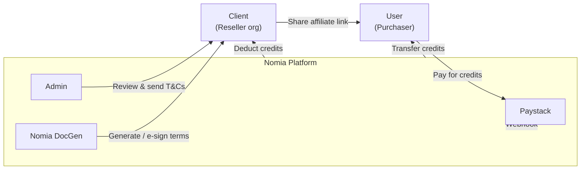

---

## High-level overview

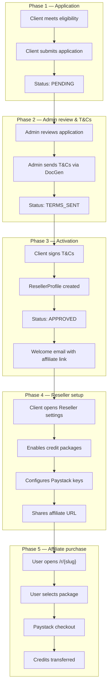

---

## Application status lifecycle

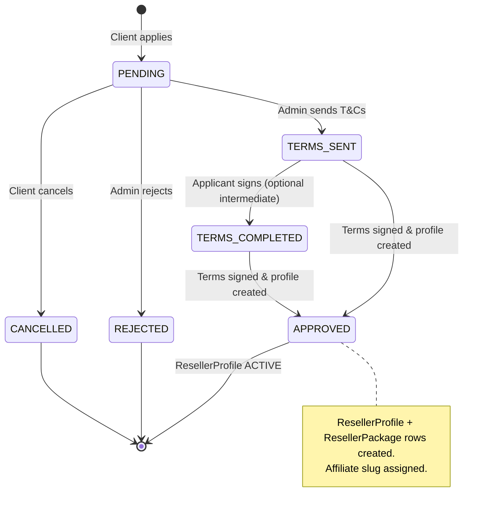

| Status            | Meaning                                | Client UI                                        | Admin UI                      |
| ----------------- | -------------------------------------- | ------------------------------------------------ | ----------------------------- |
| `PENDING`         | Application submitted, awaiting review | Apply button disabled; "application in progress" | Visible in applications table |
| `TERMS_SENT`      | T&Cs generated and sent                | No Reseller sidebar yet                          | Can resend T&Cs               |
| `TERMS_COMPLETED` | Signed but not yet fully activated     | No Reseller sidebar yet                          | Rare intermediate state       |
| `APPROVED`        | Reseller activated                     | **Reseller** menu appears                        | Application complete          |
| `REJECTED`        | Declined                               | Can re-apply after reset                         | Shows rejection               |
| `CANCELLED`       | Withdrawn                              | Can re-apply                                     | Archived                      |

---

## Admin flow

### What the admin does

1. **Configure site settings** (one-time setup)
2. **Review pending applications**
3. **Send Terms & Conditions** to selected applicants
4. **Monitor** until reseller is activated (automatic on e-sign completion)

### Step-by-step

| Step | Action                                                                                  | URL / location                                         |
| ---- | --------------------------------------------------------------------------------------- | ------------------------------------------------------ |
| 1    | Log in as admin                                                                         | `/admin`                                               |
| 2    | Open **Site Settings**                                                                  | `/admin/site-settings`                                 |
| 3    | Set reseller DocGen template ID, workspace ID (and optional internal template fallback) | Site Settings → Reseller section                       |
| 4    | Open **Reseller Applications**                                                          | `/admin/reseller-applications`                         |
| 5    | Search/filter applications                                                              | Table supports query by org name, applicant, email     |
| 6    | Select one or more `PENDING` applications                                               | Multi-select in table                                  |
| 7    | Click **Send T&Cs**                                                                     | Opens `SendResellerTermsDialog`                        |
| 8    | Fill template variables (e.g. `Preparedby`, `Client1`, `CEO`, …)                        | Per application                                        |
| 9    | Choose DocGen options                                                                   | Show in Nomia / Build for e-sign / **Send for e-sign** |
| 10   | Submit                                                                                  | Calls `admin.resellerApplications.sendTerms`           |

### Admin send-T&Cs diagram

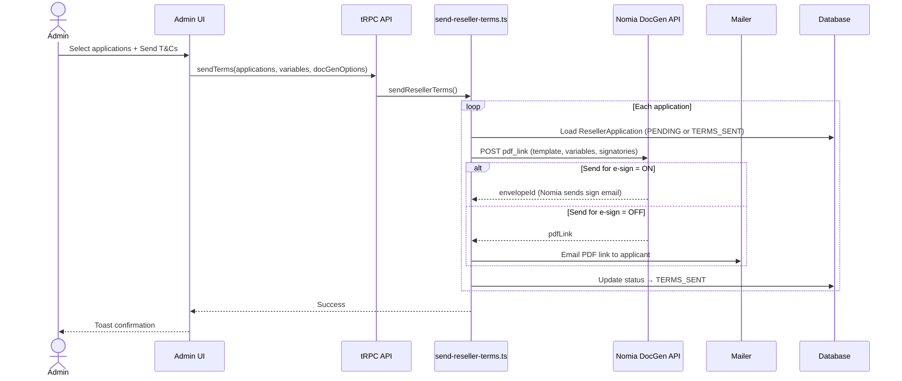

### DocGen options explained

| Option               | Effect                                                                                                             |
| -------------------- | ------------------------------------------------------------------------------------------------------------------ |
| **Show in Nomia**    | Document visible in Nomia workspace                                                                                |
| **Build for e-sign** | Document prepared for signing workflow                                                                             |
| **Send for e-sign**  | Nomia sends signing invitation to applicant. **Required for automatic reseller activation** via local seal handler |

> **Important:** If **Send for e-sign** is OFF, the applicant only receives a PDF link email. The application stays at `TERMS_SENT` and **no `ResellerProfile` is created automatically**.

### Admin environment variables

| Variable                    | Purpose                                              |
| --------------------------- | ---------------------------------------------------- |
| `NOMIA_DOCGEN_AUTH_TOKEN`   | JWT for DocGen API                                   |
| `NOMIA_DOCGEN_API_KEY`      | Workspace API key                                    |
| `NOMIA_DOCGEN_WORKSPACE_ID` | Default workspace (fallback if not in site settings) |
| `NOMIA_DOCGEN_API_ENDPOINT` | Defaults to `pdf_link` endpoint                      |

---

## Client flow (reseller organisation)

The **client** is the organisation applying to resell credits (e.g. "Nomia Creator").

### Phase A — Apply to become a reseller

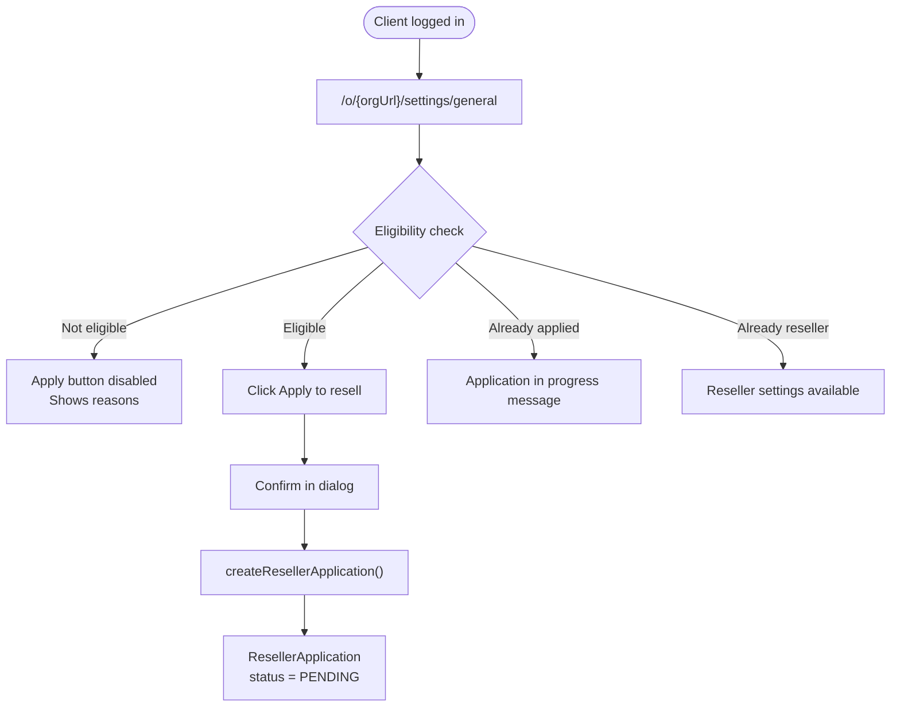

#### Eligibility requirements

| Requirement             | Default value                         | Bypass                                                       |
| ----------------------- | ------------------------------------- | ------------------------------------------------------------ |
| Credits used            | ≥ **50** e-sign credits               | Dev allowlist emails in `RESELLER_ELIGIBILITY_BYPASS_EMAILS` |
| Subscription tenure     | ≥ **2 months**                        | Same bypass                                                  |
| No existing application | None in progress                      | —                                                            |
| No existing profile     | Not already a reseller                | —                                                            |

**Client URL:** `/o/{orgUrl}/settings/general` → **Apply to resell e-sign credits** section

---

### Phase B — Wait for T&Cs & sign

| Step | What happens                                                | Client action                      |
| ---- | ----------------------------------------------------------- | ---------------------------------- |
| 1    | Admin sends T&Cs                                            | Check email                        |
| 2    | Receive signing invite (e-sign ON) or PDF link (e-sign OFF) | Open link / sign document          |
| 3    | On e-sign completion                                        | Automatic activation (see Phase C) |

---

### Phase C — Activation (automatic)

When the applicant **completes signing** on a document whose envelope ID matches `ResellerApplication.termsEnvelopeId`:

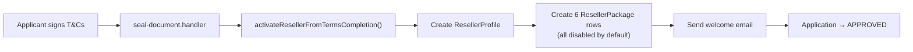

**Created automatically:**

- `ResellerProfile` with `status = ACTIVE`
- `affiliateSlug` = `{org-url-normalized}-{6-char-nanoid}` (e.g. `org-oefzxtceebfvocdy-2idCGL`)
- 6 `ResellerPackage` rows (one per catalog package, `isEnabled = false`)
- Welcome email containing affiliate URL

---

### Phase D — Configure reseller settings

Once `ResellerProfile` exists, the **Reseller** menu appears in org settings.

**URL:** `/o/{orgUrl}/settings/reseller`

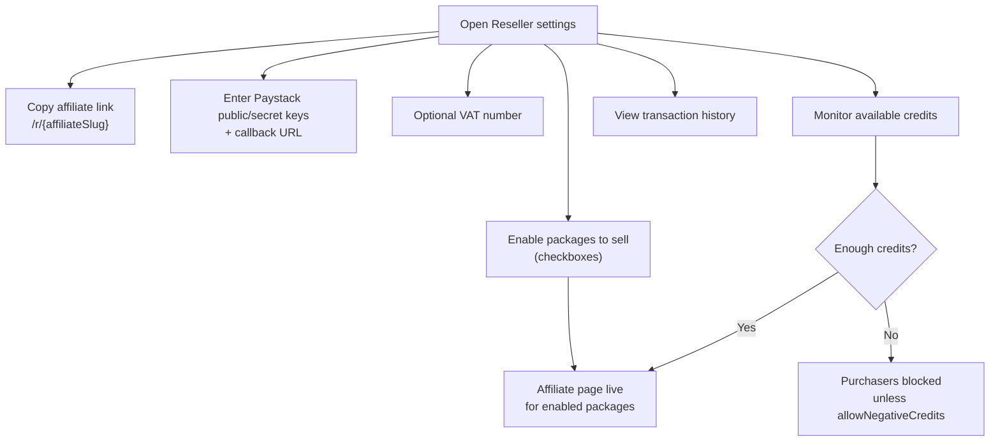

| Setting               | Purpose                                                                   |
| --------------------- | ------------------------------------------------------------------------- |
| **Affiliate link**    | Share with customers — must match `ResellerProfile.affiliateSlug` exactly |
| **Paystack keys**     | Reseller's own Paystack account (future/direct use)                       |
| **Enabled packages**  | Only checked packages appear on `/r/{slug}`                               |
| **Available credits** | Purchases deduct from reseller's org credit balance                       |

> **Tip:** Always copy the affiliate link from Reseller settings. Do not guess the slug — manual DB inserts may use a custom slug (e.g. `nomia-creator-dev001`).

---

## User flow (affiliate purchaser)

The **user** is any logged-in Nomia customer who visits a reseller's affiliate link to buy credits.

**URL pattern:** `/r/{affiliateSlug}`  
**Example:** `http://localhost:3000/r/nomia-creator-dev001`

### Affiliate page flow

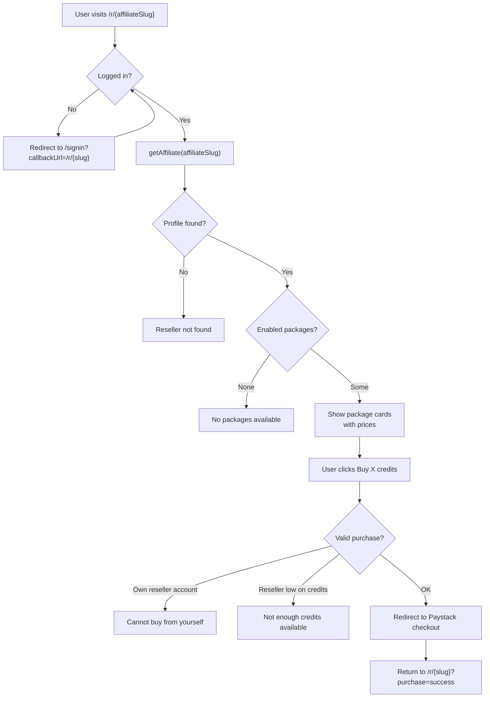

### Purchase validation rules

| Rule                                                        | Error if violated                                |
| ----------------------------------------------------------- | ------------------------------------------------ |
| Affiliate slug must exist in `ResellerProfile`              | "Reseller not found"                             |
| Package must be `isEnabled = true`                          | "Package is not available"                       |
| Purchaser org ≠ reseller org                                | "Cannot purchase from your own reseller account" |
| Reseller has enough credits (unless `allowNegativeCredits`) | "Not enough credits available"                   |

### User sequence diagram

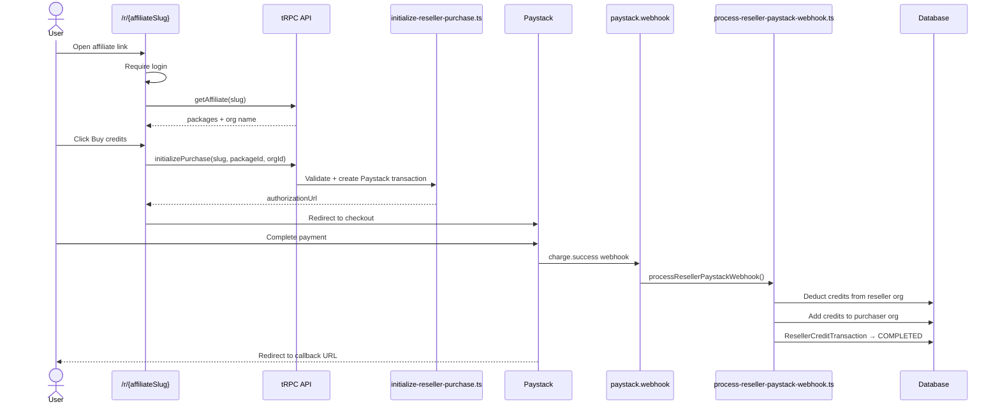

### What the user sees on the affiliate page

| State               | UI message                                               |
| ------------------- | -------------------------------------------------------- |
| Invalid slug        | **Reseller not found** — link invalid or inactive        |
| No enabled packages | **No packages available**                                |
| Success             | Package cards with name, price, **Buy X credits** button |
| After payment       | Redirected back with `?purchase=success` query param     |

---

## Paystack payment & credit transfer

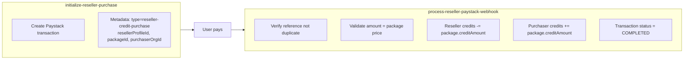

**Idempotency:** If the same `paystackReference` is processed twice, the second call returns `{ duplicate: true }` without double-transferring credits.

---

## End-to-end sequence diagram

Full journey from application to credit purchase:

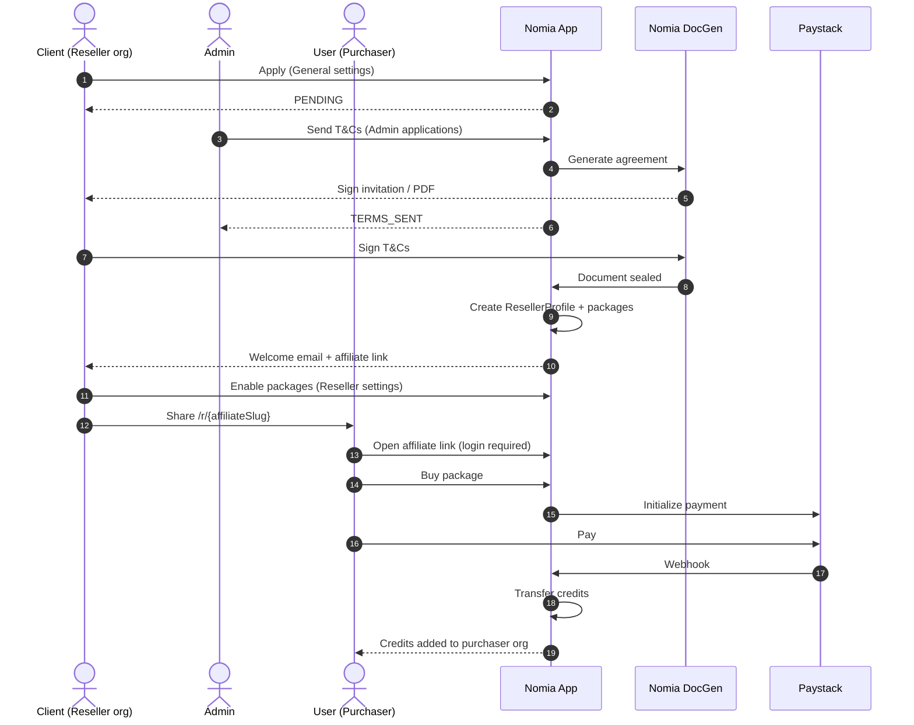

---

## Data model

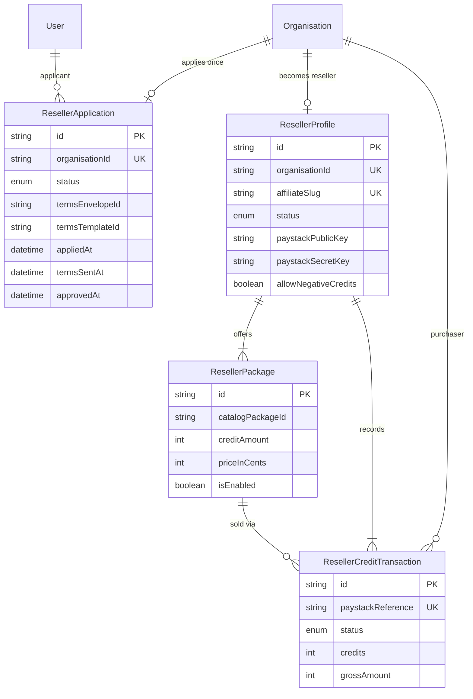

### Credit catalog packages (default 6)

| Catalog ID  | Credits | Display price (test) |
| ----------- | ------- | -------------------- |
| `payg-20`   | 20      | ZAR 190              |
| `payg-50`   | 50      | ZAR 450              |
| `payg-100`  | 100     | ZAR 850              |
| `payg-200`  | 200     | ZAR 1,600            |
| `payg-500`  | 500     | ZAR 3,750            |
| `payg-1000` | 1000    | ZAR 7,000            |

All packages are created with `**isEnabled = false**` — the client must enable them in Reseller settings.

---

## Routes & URLs reference

### Admin

| Route                          | Purpose                                   |
| ------------------------------ | ----------------------------------------- |
| `/admin/site-settings`         | DocGen template & workspace configuration |
| `/admin/reseller-applications` | Review applications, send T&Cs            |

### Client (reseller organisation)

| Route                           | Purpose                                          |
| ------------------------------- | ------------------------------------------------ |
| `/o/{orgUrl}/settings/general`  | Apply to become a reseller                       |
| `/o/{orgUrl}/settings/reseller` | Affiliate link, Paystack, packages, transactions |

### User (affiliate purchaser)

| Route                                    | Purpose                               |
| ---------------------------------------- | ------------------------------------- |
| `/r/{affiliateSlug}`                     | Buy credits from a reseller           |
| `/signin?callbackUrl=/r/{affiliateSlug}` | Login redirect when not authenticated |

### API / background

| Path                         | Purpose                                         |
| ---------------------------- | ----------------------------------------------- |
| `POST /api/paystack/webhook` | Processes `reseller-credit-purchase` payments   |
| `seal-document.handler`      | Triggers reseller activation on T&Cs completion |

---

## Testing checklist

### As Admin

- Configure DocGen template ID (e.g. `839`) and workspace ID in Site Settings
- Verify env vars: `NOMIA_DOCGEN_AUTH_TOKEN`, `NOMIA_DOCGEN_API_KEY`
- Open `/admin/reseller-applications` and see pending application
- Send T&Cs with template variables filled
- Confirm application status → `TERMS_SENT`
- (E-sign path) Confirm activation after client signs → `APPROVED`

### As Client

- Meet eligibility (50 credits + 2 months) or use bypass email
- Apply from `/o/{orgUrl}/settings/general`
- Receive and sign T&Cs (or PDF link if e-sign off)
- See **Reseller** in org settings sidebar after activation
- Copy affiliate link from `/o/{orgUrl}/settings/reseller`
- Enable at least one package
- Ensure organisation has enough credits for expected sales

### As User (affiliate page)

- Open correct URL: `/r/{affiliateSlug}` (slug from Reseller settings, not guessed)
- Redirect to sign-in if logged out; return to affiliate page after login
- See enabled packages with prices
- Click **Buy credits** → Paystack checkout
- After payment: credits added to purchaser org, deducted from reseller org
- Reseller sees transaction in Reseller settings history

---

## Known behaviour & dev notes

### Affiliate slug must match the database

The slug in the URL **must exactly match** `ResellerProfile.affiliateSlug`.

| Source                       | Example slug                  |
| ---------------------------- | ----------------------------- |
| Auto-generated on activation | `org-oefzxtceebfvocdy-2idCGL` |
| Manual SQL / custom insert   | `nomia-creator-dev001`        |

Wrong slug → **"Reseller not found"** (this is expected).

### Activation paths

| Path                                | Creates profile?     | Sets APPROVED?     |
| ----------------------------------- | -------------------- | ------------------ |
| E-sign T&Cs completed (local seal)  | ✅ Yes                | ✅ Yes              |
| PDF link only (Send for e-sign OFF) | ❌ No                 | ❌ Stays TERMS_SENT |
| Manual SQL insert                   | ✅ If you insert rows | Manual             |

### Reseller sidebar visibility

The **Reseller** menu appears when `getProfile` returns a `ResellerProfile` — **not** when application status is `APPROVED` alone without a profile row.

### Dev eligibility bypass

These emails skip the 50-credit / 2-month requirements (see `esign-credit-packages.ts`):

- `nomiadeveloper@gmail.com`
- `nomiacreator@gmail.com`

### Common affiliate page errors (fixed / expected)

| Symptom                     | Cause                            | Fix                                                    |
| --------------------------- | -------------------------------- | ------------------------------------------------------ |
| "Oops something went wrong" | JS crash on `organisations.find` | Fixed — session returns array, not `{ organisations }` |
| "Reseller not found"        | Wrong `affiliateSlug` in URL     | Use link from Reseller settings                        |
| "No packages available"     | All packages `isEnabled = false` | Enable packages in Reseller settings                   |
| Buy button disabled         | User has no organisation         | User must belong to an org                             |
| Purchase failed             | Reseller out of credits          | Top up reseller org credits                            |

---

## Quick reference — status → who can do what

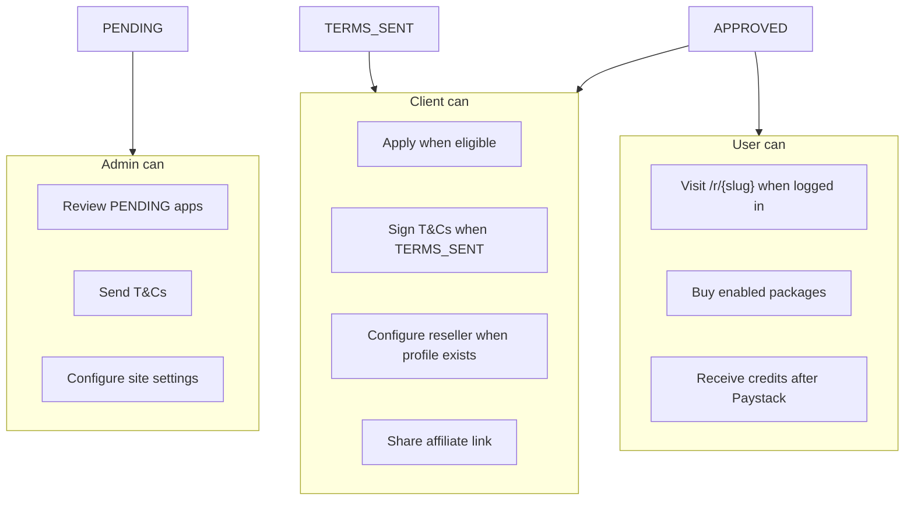

---

*Last updated: July 2026 — reflects reseller implementation in `documenso-revamp`.*