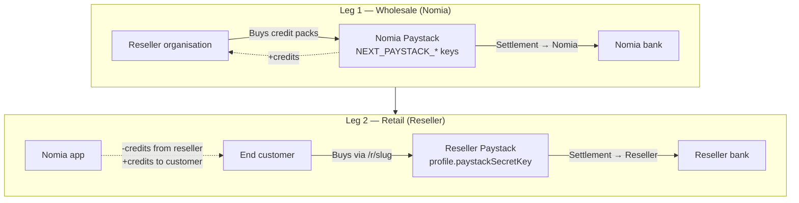
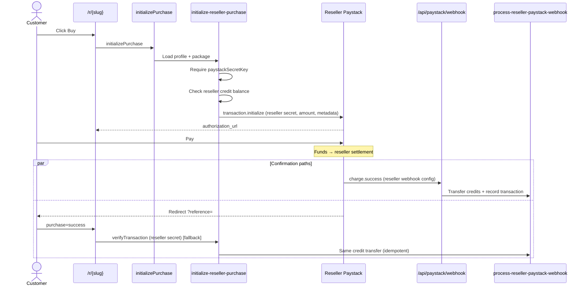

# Reseller Paystack Implementation Plan

**Goal:** End users who buy credits via `/r/{affiliateSlug}` pay the **reseller’s Paystack account**, not Nomia’s. Nomia only orchestrates checkout metadata and **transfers credits** (reseller → buyer) after payment is confirmed.

**Status:** Plan only — not yet implemented.

**Related docs:** [RESELLER-AFFILIATE-FLOW.md](./RESELLER-AFFILIATE-FLOW.md)

---

## Table of contents

1. [Business model](#1-business-model)
2. [Current vs target](#2-current-vs-target)
3. [Architecture](#3-architecture)
4. [Implementation phases](#4-implementation-phases)
5. [File change map](#5-file-change-map)
6. [API & data contracts](#6-api--data-contracts)
7. [Security](#7-security)
8. [Reseller onboarding checklist](#8-reseller-onboarding-checklist)
9. [Testing plan](#9-testing-plan)
10. [Risks & mitigations](#10-risks--mitigations)
11. [Out of scope (v1)](#11-out-of-scope-v1)
12. [Acceptance criteria](#12-acceptance-criteria)

---

## 1. Business model

Two separate payment legs:



| Leg | Payer | Payee (money) | Nomia responsibility |
|-----|-------|---------------|----------------------|
| **1** | Reseller | **Nomia** | Sell credits; existing billing / Paystack shop |
| **2** | Customer | **Reseller** | Initialize checkout on reseller account; verify payment; move credits |

**Pricing:** Retail amounts stay tied to Nomia catalog (`ESIGN_CREDIT_PACKAGES` → `ResellerPackage.priceInCents`). Resellers do **not** set custom prices in v1. Paystack **plan codes are not required** on Leg 2 — use one-off `amount` charges.

---

## 2. Current vs target

| Area | Current (wrong for model) | Target |
|------|---------------------------|--------|
| `initialize-reseller-purchase.ts` | `createTransaction()` with **Nomia** secret | `createTransaction(secretKey, …)` with **reseller** secret |
| Money on affiliate sale | Nomia Paystack | Reseller Paystack |
| `paystackPublicKey` / `paystackSecretKey` | Saved in DB, **unused** | **Required** before affiliate sales |
| `paystackCallbackUrl` | Free-text, unused | Repurpose or replace with setup instructions |
| Webhook | `charge.success` on **Nomia** account only | Events from **reseller** accounts → same handler path |
| Credit transfer | `process-reseller-paystack-webhook.ts` | **Keep** — already correct |
| Plan IDs on reseller Paystack | N/A (amount-only) | Still N/A — amount from catalog |

---

## 3. Architecture

### 3.1 Checkout flow (target)



### 3.2 Paystack client factory

Introduce a small abstraction over `paystack-sdk`:

```
packages/lib/server-only/paystack/
  index.ts              # Nomia default client (unchanged for Leg 1)
  create-paystack-client.ts   # NEW: Paystack(secretKey)
  create-transaction.ts       # NEW: initialize + verify with explicit secret
```

```ts
// create-transaction.ts (conceptual)
export const createPaystackTransaction = async (
  secretKey: string,
  options: { email; amount; callback_url; metadata },
) => { /* Paystack(secretKey).transaction.initialize */ };

export const verifyPaystackTransaction = async (
  secretKey: string,
  reference: string,
) => { /* Paystack(secretKey).transaction.verify */ };
```

Nomia billing (`initializeTransaction`, subscription webhooks) continues using the singleton in `index.ts`.

### 3.3 Webhook routing

**Problem:** Paystack webhooks are sent per **merchant account**. Reseller charges will not hit Nomia’s account webhook unless we use subaccounts/splits (out of scope v1).

**Solution v1:**

1. Document that each reseller registers **Nomia’s webhook URL** in **their** Paystack dashboard:
   - `https://{WEBAPP}/api/paystack/webhook`
2. On `charge.success`, if `metadata.type === 'reseller-credit-purchase'`:
   - Load `resellerProfileId` from metadata
   - Load `paystackSecretKey` for that profile
   - **Verify** transaction via Paystack verify API (or HMAC if we add signature validation per account)
   - Call existing `processResellerPaystackWebhook`

**Optional dedicated route (Phase B):**

- `POST /api/paystack/reseller-webhook` — same logic, clearer separation from Nomia subscription events

### 3.4 Callback fallback (Phase C)

If webhook is delayed or misconfigured:

- Redirect: `/r/{slug}?purchase=success&reference={ref}`
- Affiliate page loader/action calls `verifyAndCompleteResellerPurchase(reference, affiliateSlug)`
- Uses reseller secret to verify; calls `processResellerPaystackWebhook` (idempotent via `paystackReference` unique constraint)

---

## 4. Implementation phases

### Phase A — Paystack client per reseller (core)

**Objective:** Affiliate checkout uses reseller secret key.

| # | Task | Details |
|---|------|---------|
| A1 | Add `createPaystackTransaction(secretKey, options)` | New module; do not break existing `createTransaction` |
| A2 | Add `verifyPaystackTransaction(secretKey, reference)` | For fallback completion |
| A3 | Update `initialize-reseller-purchase.ts` | Use `profile.paystackSecretKey`; throw clear error if missing |
| A4 | Encrypt secret at rest (recommended) | See [Security](#7-security) — at minimum validate key format; encryption can be Phase A or B |
| A5 | Unit tests | Mock Paystack SDK; test missing key, successful initialize |

**Files:**

- `packages/lib/server-only/paystack/create-paystack-client.ts` (new)
- `packages/lib/server-only/paystack/create-transaction.ts` (new)
- `packages/lib/server-only/reseller/initialize-reseller-purchase.ts` (edit)

**Error messages (user-facing):**

- Reseller has no secret key → affiliate page: “This reseller has not finished payment setup.”
- Invalid Paystack response → “Payment could not be started.”

---

### Phase B — Webhook handling for reseller accounts

**Objective:** `charge.success` from reseller Paystack accounts completes credit transfer.

| # | Task | Details |
|---|------|---------|
| B1 | Refactor `paystack.webhook.ts` | Extract reseller branch into `handleResellerChargeSuccess(event)` |
| B2 | Resolve reseller from `metadata.resellerProfileId` | Load profile + secret |
| B3 | Verify charge before credit transfer | Call `verifyPaystackTransaction(resellerSecret, reference)`; confirm `amount` and `metadata` |
| B4 | Reject Nomia-key verification for reseller purchases | Do not process reseller metadata with Nomia client only |
| B5 | Integration test | Mock webhook payload with reseller metadata |

**Files:**

- `apps/remix/app/routes/api+/paystack.webhook.ts` (edit)
- `packages/lib/server-only/reseller/handle-reseller-paystack-charge.ts` (new, optional)
- `packages/lib/server-only/reseller/process-reseller-paystack-webhook.ts` (minor — ensure idempotency documented)

**Note:** Paystack amount in webhook is often in **kobo/cents** as integer — align with existing `amountInCents` handling.

---

### Phase C — Callback verification fallback

**Objective:** Credits still transfer if webhook fails.

| # | Task | Details |
|---|------|---------|
| C1 | Add `completeResellerPurchaseFromReference({ affiliateSlug, reference })` | Server function |
| C2 | Affiliate route loader or client effect | On `?purchase=success&reference=` call completion |
| C3 | Idempotency | Rely on `paystackReference` unique on `ResellerCreditTransaction` |
| C4 | UI | Show “Payment processing…” then “Credits added” or error |

**Files:**

- `packages/lib/server-only/reseller/complete-reseller-purchase.ts` (new)
- `packages/trpc/server/organisation-router/reseller-purchase.ts` (new route `completePurchase`)
- `apps/remix/app/routes/_authenticated+/r.$affiliateSlug.tsx` (edit)

---

### Phase D — Reseller settings & gating

**Objective:** Resellers cannot sell until Paystack is configured; clear instructions.

| # | Task | Details |
|---|------|---------|
| D1 | Require `paystackSecretKey` on save (or separate “Connect Paystack” step) | Validate non-empty when enabling packages |
| D2 | Block `updatePackages` if no secret key | Server-side in `updateResellerPackages` |
| D3 | `getAffiliate` response | Add `canAcceptPayments: boolean` (has secret + ACTIVE + packages) |
| D4 | Update reseller settings UI | Replace misleading `paystackCallbackUrl` placeholder with fixed Nomia webhook URL (read-only copy button) |
| D5 | Instructions panel | Steps: create Paystack account → paste keys → register webhook URL |
| D6 | `getProfile` | Return `hasPaystackConfigured: boolean` (never return full secret) |

**Files:**

- `apps/remix/app/routes/_authenticated+/o.$orgUrl.settings.reseller.tsx`
- `packages/lib/server-only/reseller/reseller-profile.ts`
- `packages/trpc/server/organisation-router/reseller-profile.types.ts`
- `packages/trpc/server/organisation-router/reseller-purchase.types.ts`

**UI copy (webhook):**

> In your Paystack Dashboard → Settings → API Keys & Webhooks, set Webhook URL to:  
> `{NEXT_PUBLIC_WEBAPP_URL}/api/paystack/webhook`

Remove or deprecate free-form `paystackCallbackUrl` in v1 (or store Nomia URL as computed read-only).

---

### Phase E — Tests & documentation

| # | Task | Details |
|---|------|---------|
| E1 | Unit tests | `initialize-reseller-purchase`, `complete-reseller-purchase`, webhook handler |
| E2 | Update `RESELLER-AFFILIATE-FLOW.md` | Two-leg money flow, reseller Paystack |
| E3 | Update `.env.example` | Note: reseller keys are per-profile, not env |
| E4 | Manual QA script | See [Testing plan](#9-testing-plan) |

---

### Phase F — Optional hardening (post-v1)

| # | Task | Details |
|---|------|---------|
| F1 | Encrypt `paystackSecretKey` at rest | KMS or app-level encryption |
| F2 | Paystack webhook HMAC per reseller | If Paystack provides per-account signing secret |
| F3 | `paystackPublicKey` on frontend | If using Paystack inline popup instead of redirect |
| F4 | Admin flag `allowAffiliateSalesWithoutPaystack` | Emergency override |
| F5 | Paystack Subaccounts / Split | Marketplace model without per-reseller webhook setup |

---

## 5. File change map

```
packages/lib/server-only/paystack/
  create-paystack-client.ts     NEW
  create-transaction.ts         NEW
  index.ts                      EDIT (re-export helpers, keep Nomia singleton)

packages/lib/server-only/reseller/
  initialize-reseller-purchase.ts    EDIT  → reseller secret
  complete-reseller-purchase.ts      NEW   → verify + complete
  handle-reseller-paystack-charge.ts NEW   → webhook helper (optional)
  reseller-profile.ts                EDIT  → gating helpers
  reseller-paystack.test.ts          NEW   → unit tests

packages/trpc/server/organisation-router/
  reseller-purchase.ts               EDIT  → completePurchase route
  reseller-purchase.types.ts           EDIT
  reseller-profile.types.ts            EDIT  → hasPaystackConfigured

apps/remix/app/routes/
  api+/paystack.webhook.ts             EDIT  → reseller verify path
  _authenticated+/r.$affiliateSlug.tsx EDIT  → callback + messaging
  _authenticated+/o.$orgUrl.settings.reseller.tsx EDIT → instructions

docs/
  RESELLER-AFFILIATE-FLOW.md           EDIT
  RESELLER-PAYSTACK-IMPLEMENTATION-PLAN.md  (this file)
```

**No Prisma migration required for v1** — `paystackSecretKey` / `paystackPublicKey` already exist on `ResellerProfile`.

---

## 6. API & data contracts

### 6.1 Paystack initialize metadata (unchanged shape)

```json
{
  "type": "reseller-credit-purchase",
  "resellerProfileId": "cmr...",
  "purchaserOrganisationId": "org_...",
  "purchaserUserId": 4,
  "packageId": "cmr...",
  "expectedAmount": 45000,
  "creditAmount": 50
}
```

Paystack metadata limits: keep keys short; values stringified if needed per Paystack API.

### 6.2 `getAffiliate` response (additions)

```ts
{
  affiliateSlug: string;
  organisationName: string;
  availableCredits: number;
  hasPackages: boolean;
  canAcceptPayments: boolean;  // NEW
  packages: [...];
}
```

`canAcceptPayments = profile.status === ACTIVE && hasPaystackSecret && packages.length > 0`

### 6.3 `initializePurchase` preconditions

1. Profile ACTIVE  
2. `paystackSecretKey` present  
3. Package enabled  
4. Purchaser ≠ reseller org  
5. Reseller credits ≥ package size (unless `allowNegativeCredits`)

---

## 7. Security

| Concern | Approach |
|---------|----------|
| Secret key storage | Never return `paystackSecretKey` from `getProfile`; mask in UI; consider encryption (Phase F) |
| Secret in logs | Redact in Paystack error logging |
| Webhook spoofing | Always **verify** transaction with reseller secret before credit transfer; do not trust body alone |
| Double credit grant | `paystackReference` unique + `COMPLETED` short-circuit in `processResellerPaystack-webhook` |
| Amount tampering | Compare verified Paystack amount to `pkg.priceInCents` and `metadata.expectedAmount` |
| Self-purchase | Already blocked in `initialize-reseller-purchase` |

---

## 8. Reseller onboarding checklist

Document for resellers (in Reseller settings UI):

1. Create / log in to **your** Paystack business account  
2. Copy **Test** or **Live** secret key into Nomia Reseller settings  
3. In Paystack → **Settings → Webhooks**, set URL to Nomia’s `/api/paystack/webhook`  
4. Buy wholesale credits from Nomia (Leg 1)  
5. Enable packages in Reseller settings  
6. Share affiliate link `/r/{your-slug}`  
7. Ensure enough credits in balance for expected sales  

---

## 9. Testing plan

### Unit tests

- `initialize-reseller-purchase` fails without secret key  
- `initialize-reseller-purchase` calls Paystack with reseller secret (mocked)  
- `process-reseller-paystack-webhook` idempotent on duplicate reference  
- `complete-reseller-purchase` verifies then completes once  

### Manual E2E (two Paystack accounts)

| Step | Actor | Action | Expected |
|------|-------|--------|----------|
| 1 | Reseller | Buy credits from Nomia shop | Reseller balance increases |
| 2 | Reseller | Save Paystack test keys + webhook URL | Settings saved |
| 3 | Reseller | Enable package | Shows on affiliate page |
| 4 | Customer | Open `/r/{slug}`, buy package | Redirect to **reseller** Paystack checkout |
| 5 | Customer | Complete test payment | Money in reseller test dashboard |
| 6 | System | Webhook or callback | Customer credits ↑, reseller credits ↓ |
| 7 | Reseller | View transactions table | Row COMPLETED |

### Regression

- Nomia direct credit purchase (Leg 1) still uses Nomia keys  
- Subscription webhooks unaffected  
- Affiliate page still handles invalid slug / no packages  

---

## 10. Risks & mitigations

| Risk | Impact | Mitigation |
|------|--------|------------|
| Reseller forgets webhook URL | Payment succeeds, no credits | Callback verify (Phase C); email alert; UI warning if no completed txns |
| Reseller uses live key in dev | Real charges | Env badge; validate key prefix `sk_test_` vs `sk_live_` against `NEXT_PUBLIC_WEBAPP_URL` |
| Webhook shared URL confusion | Wrong handler | Clear docs; optional dedicated `/reseller-webhook` route |
| Insufficient reseller credits at webhook time | Paid customer, no credits | Check balance at initialize **and** webhook; consider reserving credits (future) |
| Paystack metadata size limits | Initialize fails | Minimal metadata; store pending tx in DB by reference (future) |

---

## 11. Out of scope (v1)

- Reseller custom pricing (catalog prices only)  
- Paystack plan codes on reseller account  
- Paystack Subaccounts / transaction splits  
- Automatic payout from Nomia to reseller (Leg 1 is separate)  
- VAT calculation on reseller sales (field exists; logic TBD)  
- Refund flow (`ResellerCreditTransactionStatus.REFUNDED`)  

---

## 12. Acceptance criteria

**Done when:**

- [ ] Affiliate checkout initializes Paystack with **reseller** `paystackSecretKey`  
- [ ] Test payment appears in **reseller’s** Paystack dashboard, not Nomia’s  
- [ ] On successful payment, credits move **reseller org → purchaser org**  
- [ ] `ResellerCreditTransaction` recorded as `COMPLETED`  
- [ ] Duplicate webhook/callback does not double-transfer credits  
- [ ] Affiliate sales blocked when reseller has no Paystack secret  
- [ ] Nomia wholesale credit purchase unchanged  
- [ ] Docs updated (`RESELLER-AFFILIATE-FLOW.md`)  

---

## Suggested implementation order

```
Phase A (checkout) → Phase B (webhook) → Phase C (callback fallback)
        ↓
Phase D (UI/gating) → Phase E (tests + docs)
        ↓
Phase F (hardening, as needed)
```

**Estimated effort:** ~2–4 dev days for Phases A–E, assuming Paystack test accounts available for both Nomia and a test reseller.

---

## Decision log

| Decision | Choice | Rationale |
|----------|--------|-----------|
| Plan codes on Leg 2? | **No** — amount-only | Same prices without syncing `PLN_` across accounts |
| Webhook URL | Single Nomia endpoint | Reseller registers it in their Paystack dashboard |
| Nomia money on Leg 2? | **None** | Matches reseller wholesale/retail model |
| Schema changes? | **None for v1** | Fields already on `ResellerProfile` |

---

*Created: July 2026. Review before starting implementation.*
